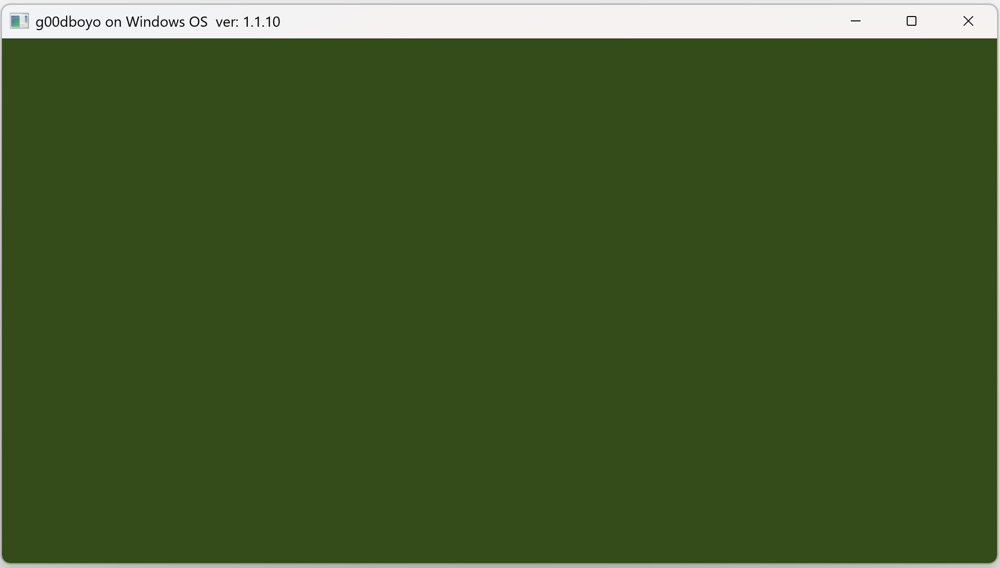

# Content

- [Info](#Info)
- [GLFW build](#GLFW-build)
- [Project build](#Project-build)

## Info

For this project used:

 - [GLFW](https://www.glfw.org/)
 - [GLAD2](https://gen.glad.sh/)
 - [CMake](https://cmake.org/)

[Visual Studio](https://visualstudio.microsoft.com) solution used on first commit.

Instead of [GLAD2](https://gen.glad.sh/) you can use [GLAD](https://glad.dav1d.de/).

You need change file names **gl.h** to **glad.h**, **gl.c** to **glad.c**.
In the file **glad.c** change **\#include glad/gl.h** to **\#include glad/glad.h**.

GLFW static libraries are used.

Builded project looks like this:


## GLFW build

1. Windows

	You may need to install some dependencies.
	
	Used:
	- **Windows 11** OS
	- **Visual Studio 17 2022** generator

	- x86:
	```
		cmake -S . -B ./build -A win32
		cmake --build ./build --config release
		cmake --build ./build --config debug
	```
	- x64:
	```
		cmake -S . -B ./build -A x64
		cmake --build ./build --config release
		cmake --build ./build --config debug
	```
	
2. Linux

	You may need to install some dependencies like [Wayland](https://www.glfw.org/docs/latest/compile_guide.html#compile_deps) and [X11](https://www.glfw.org/docs/latest/compile_guide.html#compile_deps) and so on.
	
	**For 32-bit build better to use 32-bit OS, otherwise it may not build correctly.**
	
	Used:
	- **Fedora 40 (Forty)** OS
	- **Unix Makefiles** generator
	
	- x86:
	```
		cmake -S . -B ./build -D CMAKE_C_FLAGS="-m32" -D CMAKE_BUILD_TYPE="Debug"
		cmake --build ./build
		cmake -S . -B ./build -D CMAKE_C_FLAGS="-m32" -D CMAKE_BUILD_TYPE="Release"
		cmake --build ./build
	```
	- x64:
	```
		cmake -S . -B ./build -D CMAKE_C_FLAGS="-m64" -D CMAKE_BUILD_TYPE="Debug"
		cmake --build ./build
		cmake -S . -B ./build -D CMAKE_C_FLAGS="-m64" -D CMAKE_BUILD_TYPE="Release"
		cmake --build ./build
	```
	
3. Mac OS

	**32-bit isn't supported**.
	
	Used:
	- **Sequoia 15.1** OS
	- **Xcode 16.1** generator

	- x64:
	```
		cmake -S . -B ./build -G Xcode
		cmake --build ./build --config Release
		cmake --build ./build --config Debug
	```
	
## Project build

1. Windows

	You may need to install some dependencies like **OpenGL** and so on.
	
	Used:
	- **Windows 11** OS
	- **Visual Studio 17 2022** generator

	- x86:
	```
		cmake -S . -B ./build -A win32
		cmake --build ./build --config release
		cmake --build ./build --config debug
	```
	- x64:
	```
		cmake -S . -B ./build -A x64
		cmake --build ./build --config release
		cmake --build ./build --config debug
	```

2. Linux

	You may need to install some dependencies like [OpenGL](https://en.wikibooks.org/wiki/OpenGL_Programming/Installation/Linux) and so on.
	When compiling on x86 you can get some errors like **i386 architecture of input file is incompatible with i386:x86-64 output** and so on.
	
	**For 32-bit build better to use 32-bit OS, otherwise it may not build correctly.**
	
	Used:
	- **Fedora 40 (Forty)** OS
	- **Unix Makefiles** generator
	
	- x86:
	```
		cmake -S . -B ./build -D CMAKE_C_FLAGS="-m32" -D CMAKE_BUILD_TYPE="Debug"
		cmake --build ./build
		cmake -S . -B ./build -D CMAKE_C_FLAGS="-m32" -D CMAKE_BUILD_TYPE="Release"
		cmake --build ./build
	```
	- x64:
	```
		cmake -S . -B ./build -D CMAKE_C_FLAGS="-m64" -D CMAKE_BUILD_TYPE="Debug"
		cmake --build ./build
		cmake -S . -B ./build -D CMAKE_C_FLAGS="-m64" -D CMAKE_BUILD_TYPE="Release"
		cmake --build ./build
	```
	
3. Mac OS
	
	[Info](https://www.glfw.org/docs/latest/build_guide.html#build_link_xcode) for build on Mac OS.
	
	**32-bit isn't supported**.
	
	Used:
	- **Sequoia 15.1** OS
	- **Xcode 16.1** generator

	- x64:
	```
		cmake -S . -B ./build -G Xcode
		cmake --build ./build --config Release
		cmake --build ./build --config Debug
	```